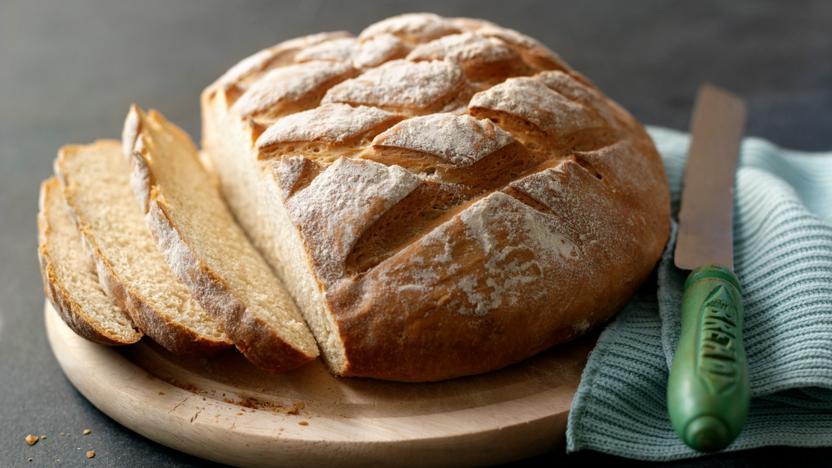

# Title

This is the first paragraph of my file.

This is the second paragraph of my file.

This is the third paragraph of my file.  
This is the third paragraph of my file. This is the third paragraph of my file. This is the third paragraph of my file. This is the third paragraph of my file. This is the third paragraph of my file. This is the third paragraph of my file. This is the third paragraph of my file. This is the third paragraph of my file. This is the third paragraph of my file.

## Visual elements

### Bold

This is **bold** text.

### Italic

This is *italic* text.

### Bold italic

This is ***bold and italic*** text.

### Quote

This is a quote: 
> Lorem ipsum.  
> Etc.

### Code & formulas

#### Code phrase

This is a text with `void` code phrase.

This is a code block:

```
if cow in barn: 
    barn.add('stink')
else:
    print(barn)
```
## Linking elements

### Links to content

#### External

Like this: [Weather forecast](https://www.meteo.pl/)

#### Internal

Link to file example: [Additional information](reference.md)

### Images

#### External


#### Internal



## Lists

### Ordered

1. Point one
2. Point two
3. Point three

### Unordered

* Bullet
* Another bullet
* Yet another bullet

## Tables

| Column | Column 2 | Column 3 |
| ------ | -------- | -------- |
| Row 1 | Still Row 1 | Row 1 once more |
| Row 2 | Row 2 column 2 | You won't guess |
| Very long sentence | Another very long sentence | Row 3 |
